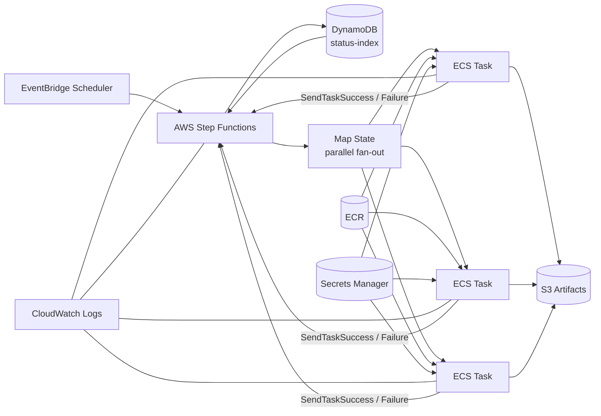
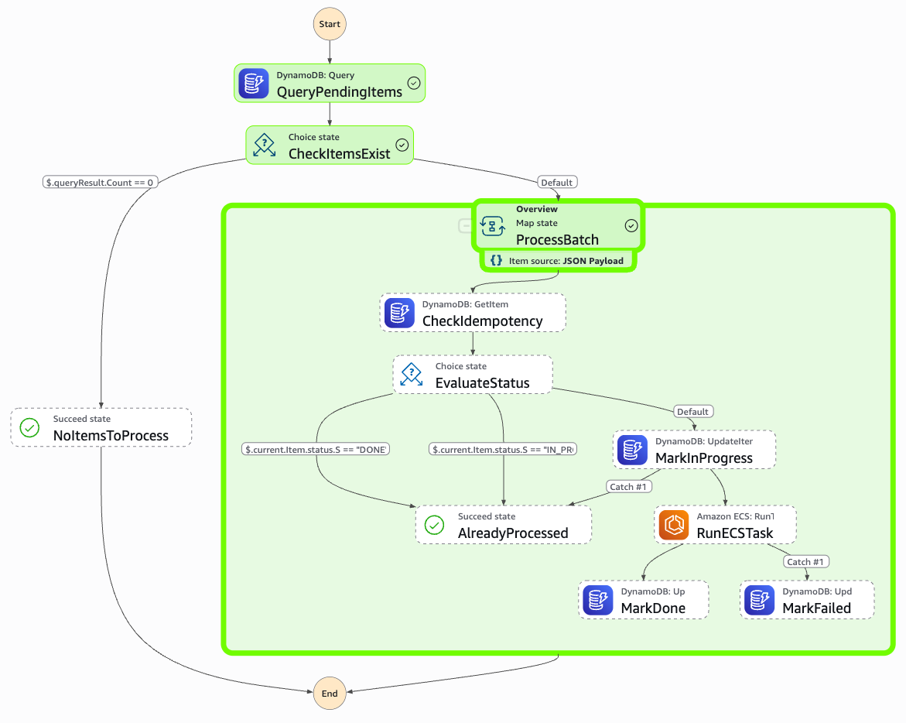
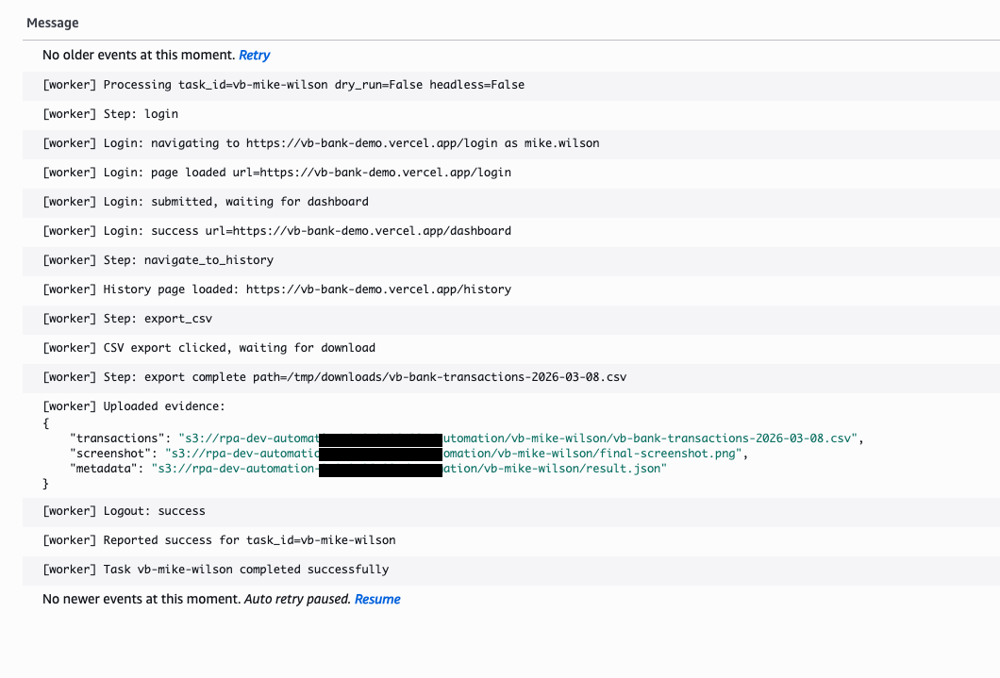

# Replacing $1M+ RPA Licensing with AWS Step Functions + ECS Fargate

> Your UiPath contract renewal is coming up. Here's what you build instead.

**Use case:** A financial services firm runs nightly automation to log into a banking portal
for each customer account, export transaction history, and archive it to S3.
With traditional RPA this requires dedicated bot servers and per-bot licensing.
With this architecture it runs on-demand in parallel containers with zero idle cost.

---

## Architecture

> One Step Functions execution. Three banking portals. Three parallel containers. $0.004.



---

## Key Patterns

### 1. Fan-out via DynamoDB GSI + Map State
DynamoDB stores one item per account with `status=PENDING`. Step Functions queries the GSI,
passes the results into a Map state, and launches one ECS Fargate task per account — all in parallel.
Tasks run across two public subnets in separate Availability Zones for resilience.

### 2. Parallel ECS tasks via `waitForTaskToken` callback
The Map state uses the Step Functions `.waitForTaskToken` integration. Each ECS container receives
a unique task token and calls `SendTaskSuccess` / `SendTaskFailure` when done.
A heartbeat thread prevents the token from timing out on long-running jobs.

### 3. Optimistic locking via conditional DynamoDB writes
Task items carry a `version` attribute. Workers use `ConditionExpression` to prevent two containers
from processing the same item simultaneously — safe for concurrent fan-out.

---

## Cost Comparison

| | UiPath Enterprise | Power Automate | **This architecture** |
|---|---|---|---|
| Licensing | $8,000–$15,000 / bot / yr | $500–$2,500 / bot / yr | **$0** |
| Infrastructure | Dedicated Windows VMs | Cloud PCs | **ECS Fargate (pay per run)** |
| Idle cost | Always-on VMs | Always-on | **$0 when not running** |
| 3-bot equivalent / yr | ~$45,000 | ~$7,500 | **~$5–15** |
| **5-year TCO (10 bots)** | **~$750,000** | **~$125,000** | **~$250** |
| Parallel scale | Requires more bots | Limited | **Unlimited (Map state)** |
| Secrets management | Bot credentials in config | Stored in platform | **AWS Secrets Manager** |

> *AWS cost estimate: 3 tasks × ~2 min × 1 vCPU / 2 GB = ~$0.004 per full pipeline run.*

---

## Scaling

This architecture scales to 1,000+ parallel tasks by changing a single number.

| Bots in parallel | UiPath / yr | Power Automate / yr | This architecture / run | **This architecture / yr\*** |
|---|---|---|---|---|
| 3 | ~$45,000 | ~$7,500 | ~$0.004 | **~$15** |
| 10 | ~$150,000 | ~$25,000 | ~$0.013 | **~$50** |
| 100 | ~$1,500,000 | ~$250,000 | ~$0.13 | **~$500** |
| 1,000 | ~$15,000,000 | ~$2,500,000 | ~$1.50 | **~$5,000** |

> \* Yearly AWS cost assumes one nightly pipeline run, 365 days/year, ~2 min per task, 1 vCPU / 2 GB Fargate.
> Shared infrastructure (VPC, NAT if used) adds a small fixed cost not reflected above.

> The secret: ECS Fargate charges per container-second.
> 1,000 containers running 2 minutes in parallel costs the same as
> 1 container running 2 minutes. Parallelism is essentially free.

To scale from 3 to 1,000 parallel tasks, change one line in Terraform:

```hcl
# step-functions.tf
max_concurrency = 1000   # was 3
```

Then seed DynamoDB with 1,000 task items and trigger Step Functions.
The Map state handles the rest.

**ECS Fargate soft limit** is 1,000 tasks per region by default.
For larger workloads, request a quota increase via AWS Service Quotas
or distribute across multiple regions.

> **Subnet IP limit:** Each ECS task consumes one IP address from the subnet.
> The default subnets in this repo are `/24` — 251 usable IPs each, 502 total across both AZs.
> To run 1,000 concurrent tasks, expand the subnets in `vpc.tf` before applying:
> ```hcl
> automation_subnet_cidrs = {
>   az1 = "10.0.0.0/22"   # 1,019 usable IPs
>   az2 = "10.0.4.0/22"   # 1,019 usable IPs
> }
> ```
> For the 3-task demo the `/24` default is more than sufficient.

---

## Stack

| Layer | Technology |
|---|---|
| Orchestration | AWS Step Functions |
| Compute | ECS Fargate (multi-AZ — 2 public subnets, no inbound) |
| State & locking | DynamoDB (GSI + conditional writes) |
| Container registry | ECR (built by CodeBuild on `terraform apply`) |
| Worker | Python + Selenium + headless Chrome (Xvfb) |
| Secrets | AWS Secrets Manager |
| Artifacts | S3 |
| Networking | VPC with public subnets, no inbound rules, multi-AZ (2 AZs) |
| Infrastructure | Terraform (flat layout) |

> **Networking note:** ECS tasks run in public subnets with all inbound traffic blocked by security group.
> Tasks initiate all outbound connections — no traffic can reach them from outside.
> For production banking workloads, replace the public subnet + `AssignPublicIp = "ENABLED"` with
> private subnets behind a NAT Gateway (`AssignPublicIp = "DISABLED"`). This removes public IPs from
> containers entirely at the cost of ~$32/month for the NAT Gateway.

---

## Project Layout

```
rpa-replacement-aws/
├── terraform/                    # All Terraform at this level (flat layout)
│   ├── main.tf                   # Provider config
│   ├── variables.tf              # All input variables
│   ├── outputs.tf                # Shared outputs
│   ├── dynamodb.tf               # automation_tasks table + GSI + TTL
│   ├── ecs-fargate.tf            # ECR, ECS cluster, task definition, IAM
│   ├── vpc.tf                    # VPC, subnets (2 AZs), IGW, route tables, security group
│   ├── step-functions.tf         # Fan-out state machine + IAM
│   ├── s3.tf                     # Artifacts bucket
│   ├── secrets.tf                # Secrets Manager credential store
│   ├── build.tf                  # CodeBuild — builds Docker image on apply
│   ├── backend.tf                # Remote state config
│   └── env/
│       ├── development.tfvars.example
│       └── development.tfbackend.example
├── docker/worker/
│   ├── Dockerfile                # python:3.12-slim + Chrome + Xvfb
│   ├── entrypoint.sh             # Starts Xvfb then runs worker.py
│   ├── worker.py                 # Selenium flow: login → history → CSV → S3
│   ├── requirements.txt          # boto3, selenium, selenium-stealth, python-dotenv
│   └── .env.example              # Local dev template
├── demos/
│   ├── 01-fan-out-pattern/
│   ├── 02-parallel-processing/
│   ├── 03-optimistic-locking/
│   ├── 04-full-pipeline/
│   │   └── seed_tasks.py         # Seeds DynamoDB with demo accounts
│   ├── 05-hybrid-ec2-windows/
│   ├── 06-sqs-autoscaling/
│   ├── 07-agentic-worker/
│   └── 08-agentcore-ops-agent/
├── buildspec.yml                 # ECR login → docker build → push :latest
├── docs/
│   └── cost-comparison.md
└── archive/                      # Inactive reference code
```

---

## Quick Start

### Prerequisites

- AWS CLI configured (`aws sso login` or IAM keys)
- Terraform >= 1.5
- Docker (for local testing only)

### 1. Create Terraform remote state (one-time)

```bash
aws s3api create-bucket --bucket rpa-tfstate-<account-id> --region us-east-1
aws s3api put-bucket-versioning --bucket rpa-tfstate-<account-id> \
  --versioning-configuration Status=Enabled
aws dynamodb create-table --table-name terraform-state-lock \
  --attribute-definitions AttributeName=LockID,AttributeType=S \
  --key-schema AttributeName=LockID,KeyType=HASH \
  --billing-mode PAY_PER_REQUEST --region us-east-1
```

Copy and fill the config templates:

```bash
cp terraform/env/development.tfbackend.example terraform/env/development.tfbackend
cp terraform/env/development.tfvars.example    terraform/env/development.tfvars
# Edit both files with your account ID and preferences
```

### 2. Deploy infrastructure + build Docker image

```bash
cd terraform
terraform init -backend-config=env/development.tfbackend
terraform apply -var-file=env/development.tfvars
```

This creates all AWS resources **and** triggers CodeBuild to build + push the Docker image to ECR automatically.

### 3. Store portal credentials

```bash
SECRET_ARN=$(terraform output -raw automation_credentials_secret_arn)

aws secretsmanager put-secret-value \
  --secret-id "$SECRET_ARN" \
  --secret-string '{"APP_PASSWORD":"user123"}' \
  --region us-east-1
```

### 4. Seed DynamoDB with demo accounts

```bash
# Dry run first
python demos/04-full-pipeline/seed_tasks.py --dry-run

# Write 3 demo banking users as PENDING tasks
python demos/04-full-pipeline/seed_tasks.py --region us-east-1
```

This seeds 3 tasks — one per demo banking user:

| task_id | Username | Account |
|---|---|---|
| `vb-john-doe` | `john.doe` | $15,000 balance, 4 transactions |
| `vb-jane-smith` | `jane.smith` | $25,500 balance, 3 transactions |
| `vb-mike-wilson` | `mike.wilson` | $8,500 balance, 1 transaction |

### 5. Run the pipeline

```bash
STATE_MACHINE_ARN=$(cd terraform && terraform output -raw state_machine_arn)

aws stepfunctions start-execution \
  --state-machine-arn "$STATE_MACHINE_ARN" \
  --region us-east-1
```

Step Functions fans out to 3 parallel ECS containers. Each container logs into the demo portal,
exports the user's transaction history as CSV, and uploads it to S3.

### 6. Check results

```bash
# S3 artifacts
aws s3 ls s3://$(cd terraform && terraform output -raw s3_bucket_name)/automation/ --recursive

# CloudWatch logs
aws logs tail /ecs/rpa-dev-automation-task --region us-east-1 --follow
```

---

## Local Development

```bash
cd docker/worker
cp .env.example .env
# Edit .env — set APP_PASSWORD=user123

# Non-headless (browser visible)
python worker.py

# Headless
HEADLESS=true python worker.py
```

Output lands in `/tmp/automation-output/vb/local/`.

---

## Demo Walkthroughs

| Demo | Pattern explained |
|---|---|
| [`01-fan-out-pattern`](demos/01-fan-out-pattern/) | DynamoDB GSI query → Step Functions Map state |
| [`02-parallel-processing`](demos/02-parallel-processing/) | Concurrent ECS tasks via `waitForTaskToken` |
| [`03-optimistic-locking`](demos/03-optimistic-locking/) | Conditional DynamoDB writes + version attribute |
| [`04-full-pipeline`](demos/04-full-pipeline/) | End-to-end orchestrated pipeline walkthrough |
| [`05-hybrid-ec2-windows`](demos/05-hybrid-ec2-windows/) | Hybrid routing pattern: Fargate for Linux, EC2 for Windows-only work |
| [`06-sqs-autoscaling`](demos/06-sqs-autoscaling/) | Continuous-work pattern: SQS backlog drives ECS service scale-out and scale-in |
| [`07-agentic-worker`](demos/07-agentic-worker/) | Goal-driven browser worker: model decides how to navigate and extract results |
| [`08-agentcore-ops-agent`](demos/08-agentcore-ops-agent/) | Conversational ops layer: natural language interface for task status, logs, requeue, and reruns |

---

## Screenshots

**Step Functions — 3 parallel ECS tasks executing**



**CloudWatch Logs — worker output per container**



---

## Author

Anil Jose — AI Automation Developer, Vancouver BC  
LinkedIn: https://www.linkedin.com/in/aniljose100/

---

## Why This Matters

UiPath bots sleep on Windows VMs and charge you for the privilege. ECS Fargate containers don't exist until you need them — and disappear the moment they're done.

Modern cloud-native automation inverts the RPA model entirely:

- **No idle cost** — ECS Fargate containers spin up on demand and terminate when done
- **Unlimited parallelism** — Step Functions Map state scales to hundreds of concurrent tasks
- **Secrets handled properly** — credentials never touch code or container images
- **Zero inbound attack surface** — VPC security group blocks all inbound traffic. ECS containers initiate all outbound connections. No ports exposed, no bastion hosts. There is nothing to attack from outside.
- **Multi-AZ resilience** — Tasks spread across 2 availability zones. Single AZ failure does not stop the pipeline.
- **Infrastructure as code** — the entire stack is reproducible with one `terraform apply`
- **Auditability** — every run produces CloudWatch logs, S3 artifacts, and DynamoDB status records

The same pattern applies to any repetitive browser-based workflow: insurance form submission,
government portal data extraction, ERP report generation, compliance screenshot capture.

> If your organization is still renewing RPA licenses in 2026, this repo is for you.
