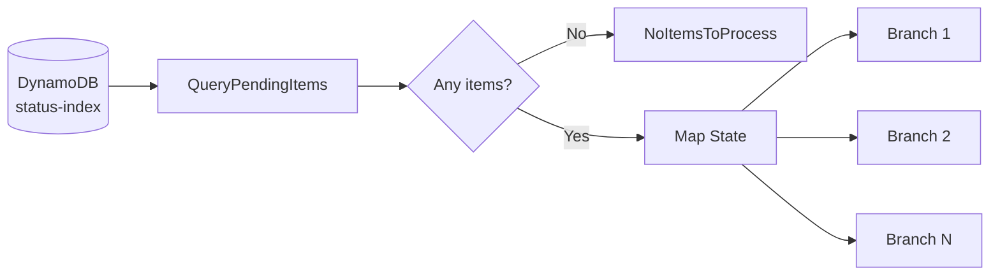

# Demo 01: Fan-Out Pattern

This demo explains the core scatter pattern in the repo: query a DynamoDB
index for pending work, then fan that work out into parallel branches with a
Step Functions `Map` state.

## Architecture

## Why it matters

- Removes the need for a single sequential bot loop.
- Lets AWS create one unit of work per task instead of one long-running RPA bot.
- Makes scaling a function of `MaxConcurrency`, not bot licenses.

## Repo mapping

- State machine query: [step-functions.tf](../../terraform/step-functions.tf)
- Table and GSI: [dynamodb.tf](../../terraform/dynamodb.tf)

## State flow

1. Query `status-index` for `PENDING` items.
2. Exit early if `Count == 0`.
3. Send each item into the `Map` iterator.
4. Let each branch claim and process its own task independently.

## What to observe

- The GSI is the work queue.
- The `Map` state is the fan-out engine.
- The repo does not need Lambda for the scatter step.
