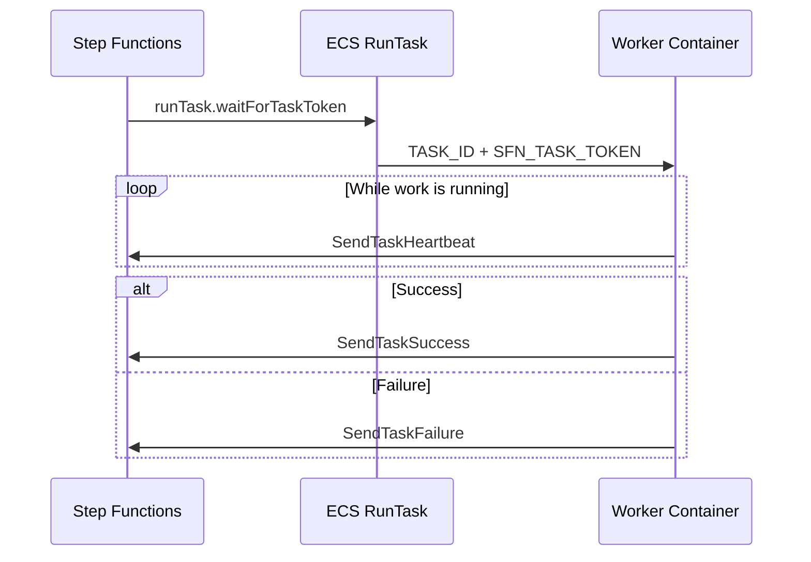

# Demo 02: Parallel Processing

This demo explains how the repo turns one Step Functions execution into many
parallel ECS tasks, each with its own callback token.

## Architecture

## Why it matters

- Each work item gets its own isolated container.
- Step Functions does not poll the container to completion; the worker calls back.
- Long-running tasks stay safe via heartbeats.

## Repo mapping

- Callback task state: [step-functions.tf](../../terraform/step-functions.tf)
- ECS task definition and IAM: [ecs-fargate.tf](../../terraform/ecs-fargate.tf)
- Worker callback logic: [worker.py](../../docker/worker/worker.py)

## Runtime flow

1. Step Functions launches an ECS task with `TASK_ID` and `SFN_TASK_TOKEN`.
2. The worker processes one account or statement.
3. A heartbeat thread keeps the task token alive.
4. The worker sends success or failure back to Step Functions.
5. Step Functions marks the DynamoDB item `DONE` or `FAILED`.

## What to observe

- Callback token injection into container env vars.
- ECS task role permission for `states:SendTaskSuccess`, `SendTaskFailure`, and `SendTaskHeartbeat`.
- `MaxConcurrency` is the parallelism control point.
