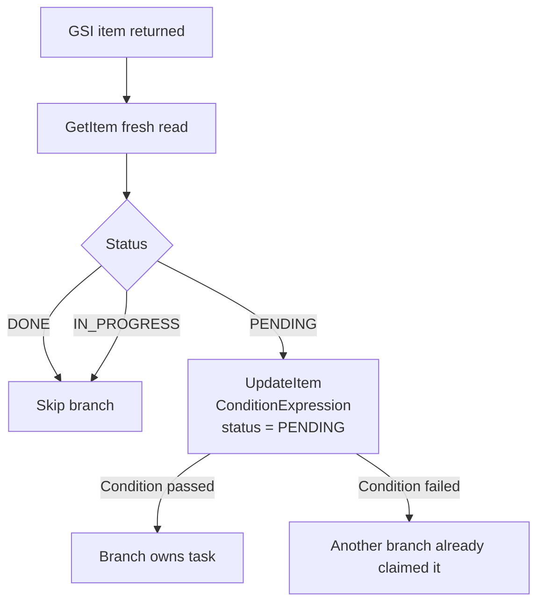

# Demo 03: Optimistic Locking And Idempotency

This demo explains how the repo prevents duplicate processing when multiple
workers or multiple executions see the same pending item.

## Architecture

## Why it matters

- GSI reads can be stale.
- Schedules can overlap.
- Multiple executions may see the same item at nearly the same time.

## Repo mapping

- Fresh read and claim logic: [step-functions.tf](../../terraform/step-functions.tf)
- Item schema: [dynamodb.tf](../../terraform/dynamodb.tf)

## Locking pattern used here

1. Re-read the item by `task_id`.
2. Skip immediately if status is already `DONE` or `IN_PROGRESS`.
3. Claim the task with `UpdateItem` only if status is still `PENDING`.
4. If the condition fails, another execution already won the claim.

## What to observe

- This repo currently uses status-based optimistic claiming, not a numeric lease manager.
- The pattern is enough for scheduled fan-out where only one worker should own a task at a time.
- The failure mode is safe: duplicate branches short-circuit instead of double-processing.
