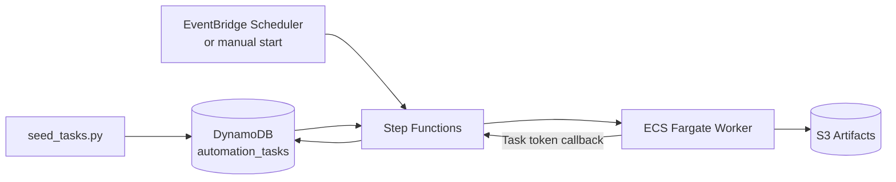
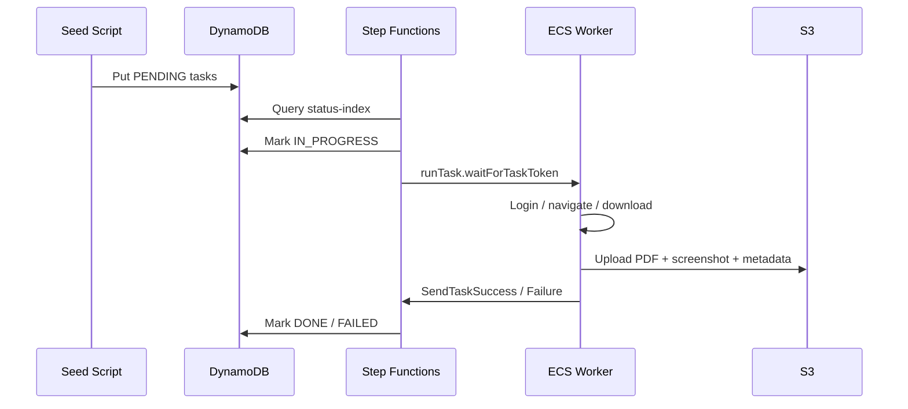

# Demo 04: Full Pipeline

This demo ties the full architecture together: seed tasks, trigger Step
Functions, launch browser automation in ECS, and store the result artifacts.

## Architecture

## Sequence

## Repo mapping

- Task seeding: [seed_tasks.py](../04-full-pipeline/seed_tasks.py)
- State machine: [step-functions.tf](../../terraform/step-functions.tf)
- ECS and container runtime: [ecs-fargate.tf](../../terraform/ecs-fargate.tf)
- Browser worker: [worker.py](../../docker/worker/worker.py)

## End-to-end flow

1. Seed `PENDING` tasks into DynamoDB.
2. Trigger the Step Functions execution manually or via scheduler.
3. Query the GSI and fan out into parallel branches.
4. Claim each item, launch an ECS task, and pass the callback token.
5. The worker logs in, downloads the statement PDF, and stores evidence.
6. The worker calls back to Step Functions.
7. Step Functions updates task status to `DONE` or `FAILED`.

## Artifacts

- Statement PDF
- Final screenshot
- Result metadata JSON

These are written to the S3 artifacts bucket in AWS runs, or to a local output
directory in `LOCAL_MODE`.

## What to observe

- This demo is the combined pattern, not a separate architecture.
- The seed script gives you repeatable input data for the pipeline.
- The whole flow replaces a traditional RPA bot runner with event-driven AWS services.
