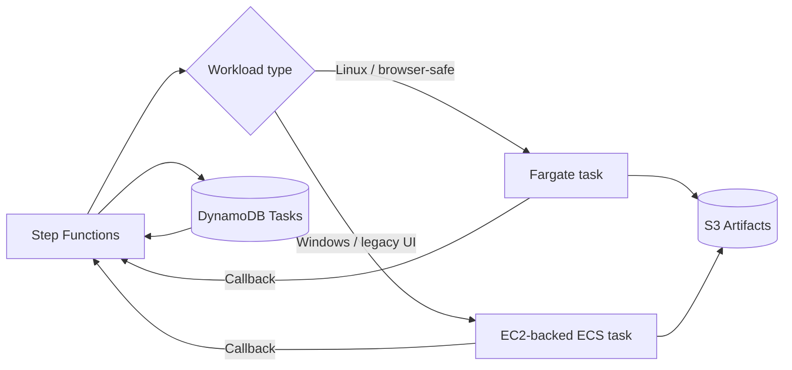
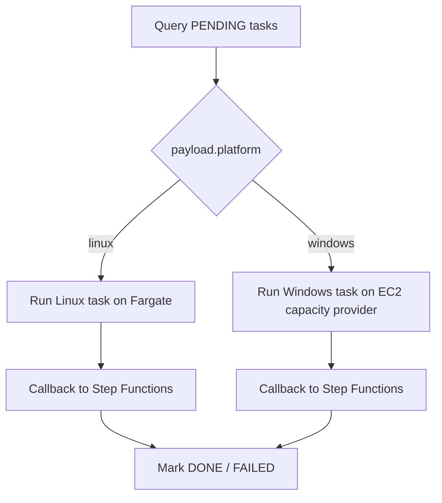

# Demo 05: Hybrid Pattern (Fargate + EC2)

This demo explains the hybrid architecture that was explored and then archived:
keep Linux-safe browser work on ECS Fargate, and add an EC2-backed ECS capacity
provider only for workloads that cannot run reliably on Fargate.

This is an architecture walkthrough, not an active deployment in the current
stack. The earlier Terraform prototype lives under [archive/terraform/ec2-windows.tf](../../archive/terraform/ec2-windows.tf).

## Architecture

## Why hybrid exists

- Some RPA-style automations run fine in Linux containers.
- Others need Windows-specific components:
  - legacy browser dependencies
  - COM / ActiveX
  - thick-client UI automation
  - desktop-only vendor software

The hybrid pattern lets you keep most jobs serverless on Fargate while routing
only the incompatible jobs to EC2 capacity.

## Capacity weight explained

The archived prototype tried to model a weighted split such as:

- `FARGATE` weight `2`
- `EC2` weight `1`

That looks attractive, but it is the wrong abstraction for this repo’s hybrid
case.

Why:

- Linux and Windows tasks are not interchangeable.
- A weighted default strategy assumes multiple providers can run the same task.
- In this repo, platform determines placement:
  - Linux tasks should go to Fargate
  - Windows-only tasks should go to EC2

So the right hybrid model is **explicit routing**, not one shared default
capacity-provider strategy.

## Recommended routing model

## What was archived

- Windows EC2 instance profile and ECS capacity provider
- Windows task definition prototype
- Hybrid seed script and tfvars example
- Windows buildspec for a separate image path

Those references remain here:

- [archive/terraform/ec2-windows.tf](../../archive/terraform/ec2-windows.tf)
- [archive/demos/05-hybrid-ec2-windows/seed_tasks.py](../../archive/demos/05-hybrid-ec2-windows/seed_tasks.py)
- [archive/demos/05-hybrid-ec2-windows/terraform.tfvars.example](../../archive/demos/05-hybrid-ec2-windows/terraform.tfvars.example)

## Recommended implementation if revived later

1. Add a platform attribute to tasks, for example `linux` or `windows`.
2. Keep the current Fargate task definition for Linux work.
3. Add a separate EC2/Windows task definition for Windows-only work.
4. Route in Step Functions based on task platform.
5. Do not rely on a shared weighted default strategy for mixed platforms.

## What to observe

- Hybrid is a placement problem, not just a scaling problem.
- Capacity weights are useful only among providers that can run the same task.
- For this repo, the main lesson is architectural: use Fargate by default, and
  add EC2 only for the minority of jobs that truly need it.
