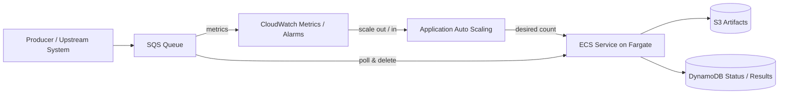

# Demo 06: SQS + ECS Autoscaling

This demo explains the event-driven sequel to the Step Functions fan-out pattern:
instead of processing a known batch immediately, work arrives continuously and is
buffered in SQS while ECS scales out based on queue depth and can scale back down
to zero with the right autoscaling policy.

This is an architecture walkthrough, not an active implementation in the current
Terraform stack.

## Architecture

## Why this pattern exists

- Step Functions fan-out is best when you already know the full list of tasks.
- SQS + ECS autoscaling is better when work arrives all day, unpredictably.
- The queue absorbs spikes and ECS scales workers only when there is backlog.

## When to use it

- New portal jobs arrive continuously from APIs, file drops, or user actions.
- Triggering a state machine per incoming item adds orchestration overhead you do not need.
- You want the worker fleet to drain the queue and scale down toward zero when idle.

## Compared with Demo 04

| Pattern | Best for | Trigger model | Scaling model |
|---|---|---|---|
| [`04-full-pipeline`](../04-full-pipeline/) | Known batch, run now, wait for completion | Step Functions execution | `Map` state + `MaxConcurrency` |
| `06-sqs-autoscaling` | Continuous stream of work | Messages arrive over time | ECS service scales from queue depth |

## Runtime flow

1. A producer writes a work item to SQS.
2. Queue depth rises.
3. A step scaling policy on `ApproximateNumberOfMessagesVisible`, or target tracking
   on backlog-per-task, increases the ECS service desired count.
4. ECS tasks pull messages, process them, and delete them from the queue.
5. As the queue drains, the scaling policy reduces desired count — down to zero
   if configured with a scale-in policy that allows it.

## Why it is compelling for RPA replacement

- It handles event-driven operations, not just nightly batch sweeps.
- It decouples producers from workers.
- Near-zero idle compute cost when the queue is empty — any baseline cost comes
  from shared infrastructure (VPC endpoints, NAT) not from workers.
- It is a strong replacement for “always-on bot runner” architectures.

## Suggested AWS building blocks

- Amazon SQS for the work queue
- ECS Fargate service for worker containers
- Application Auto Scaling for ECS desired count
- CloudWatch metrics on queue depth
- Secrets Manager for credentials
- S3 for artifacts
- DynamoDB for optional task/result tracking

## Suggested scaling signals

- `ApproximateNumberOfMessagesVisible`
- `ApproximateNumberOfMessagesNotVisible`
- backlog per task: `visible_messages / running_tasks` — note this signal
  breaks down when running tasks = 0; pair it with a step scaling alarm
  on raw queue depth to handle the cold-start case

## Design notes

- Use long polling on SQS to reduce empty receive cost.
- Make workers idempotent because messages may be delivered more than once.
- Tune visibility timeout so one worker has enough time to finish before the
  message becomes visible again.
- Add a dead-letter queue for poison messages.

## What to observe

- This is not a replacement for Step Functions; it solves a different class of workload.
- `Map` fan-out is ideal for “known batch now”.
- SQS autoscaling is ideal for “unknown stream over time”.
- Together, the two patterns cover most modern cloud-native RPA replacement use cases.
