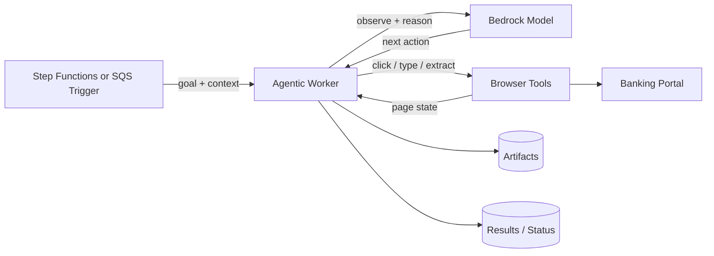

# Demo 07: Agentic Worker

This demo explains the next step after scripted browser automation: replace a
hardcoded Selenium flow with an LLM-driven worker that receives a goal and
figures out the interaction path at runtime.

This is an architecture walkthrough, not an active implementation in the current
Terraform stack.

## From scripted to agentic

Instead of:

- Selenium code that follows a fixed click path
- brittle selectors for every page state
- explicit handling for only the UI states you predicted ahead of time

Use:

- an agentic worker that receives a goal
- browser tools for observing the page and taking actions
- reasoning over what the UI currently shows
- adaptive follow-up steps when the portal behaves differently than expected

## Example goal

> Log into the banking portal and extract all transactions over $10,000 for compliance review.

## Architecture

## Why this pattern matters

- Scripted RPA breaks when the UI changes unexpectedly.
- Agentic workers can inspect the page, decide the next action, and recover from
  small UI changes without a full code rewrite.
- The worker can reason about content, not just DOM coordinates.

## When to use it

- The portal is semi-structured and changes often.
- The objective is stable, but the exact click path is not.
- You need follow-up actions based on what the worker discovers on screen.

## Compared with the current worker

| Pattern | Best for | Control model |
|---|---|---|
| Current scripted worker | Stable portal, deterministic flow | Code defines exact steps |
| `07-agentic-worker` | Changing UI, goal-driven extraction | Model decides next action |

## Runtime flow

1. The platform sends the worker a goal and task context.
2. The worker opens the portal and observes the current UI state.
3. The model decides the next action: click, type, navigate, extract, or verify.
4. The worker repeats observe → reason → act until the goal is complete.
5. Results, evidence, and any exceptions are stored just like the scripted path.

## Suggested AWS building blocks

- Amazon Bedrock for reasoning
- ECS Fargate for the worker runtime
- Browser automation tooling for actuation
- S3 for screenshots and exported evidence
- DynamoDB for task state and outputs
- Step Functions or SQS as the orchestration layer

## Design notes

- Keep deterministic guardrails around the model:
  - allowed domains
  - max steps
  - approved tools
  - explicit stop conditions
- Persist observations and actions for auditability.
- Use structured outputs for extracted records.
- Treat this as augmentation, not blind autonomy.

## What to observe

- This does not replace orchestration; it replaces brittle hardcoded UI flows.
- Step Functions and SQS still matter; the difference is the worker’s decision model.
- Agentic workers are strongest when the goal is stable but the interface is not.
