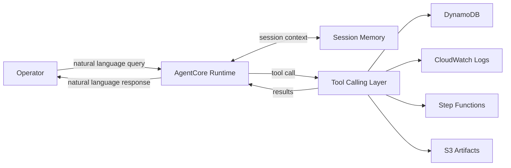

# Demo 08: AgentCore Ops Agent

This demo explains the operational layer on top of the automation pipeline:
instead of querying AWS services manually with CLI commands, an operator talks to
an AgentCore-powered assistant that can inspect task state, logs, artifacts, and
requeue or retrigger work through approved tools.

This is an architecture walkthrough, not an active implementation in the current
Terraform stack.

## Core idea

Instead of this:

```bash
aws dynamodb scan --filter-expression "status = :f" ...
aws logs tail /ecs/rpa-dev-automation-task ...
aws stepfunctions start-execution ...
```

Use this:

> "Show me all failed tasks from last night."  
> "Why did vb-jane-smith fail?"  
> "Re-run all FAILED tasks for vb bank."  
> "How many tasks completed in the last 24 hours?"

## Architecture



## Tool layer

Suggested tools:

- `query_dynamodb(filter, status, date_range)`
- `get_cloudwatch_logs(task_id)`
- `requeue_task(task_id)`
- `trigger_step_functions(execution_input)`
- `get_s3_artifact(task_id)`

## Why this pattern matters

- Ops teams should not need to memorize AWS CLI queries for common questions.
- The same pipeline becomes easier to operate when exposed through a safe
  conversational interface.
- It reduces context-switching between DynamoDB, CloudWatch, Step Functions,
  and S3.

## Example interaction

```text
Operator: Why did vb-jane-smith fail?

Agent:
vb-jane-smith failed at 02:14 UTC due to a login timeout.
I found the error in CloudWatch and the failure screenshot in S3.
Do you want me to requeue it?
```

## Suggested repo shape if implemented later

```text
08-agentcore-ops-agent/
├── agent.py
├── tools/
│   ├── dynamo.py
│   ├── cloudwatch.py
│   ├── sfn.py
│   └── s3.py
└── README.md
```

## Guardrails

- Limit tools to read-mostly operations by default.
- Require explicit confirmation for mutating actions like requeue or re-run.
- Scope artifact and log access by task or date range.
- Log all tool invocations for auditability.

## What to observe

- This is not the automation worker itself; it is the operator interface around the system.
- It complements Demo 07 — Demo 07 makes the browser worker more adaptive; Demo 08 makes the operations surface more conversational.
- This is the pattern that turns a technical pipeline into something an ops team can actually use day to day.
